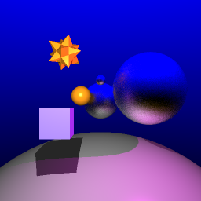
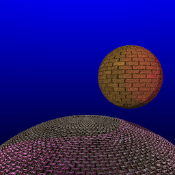
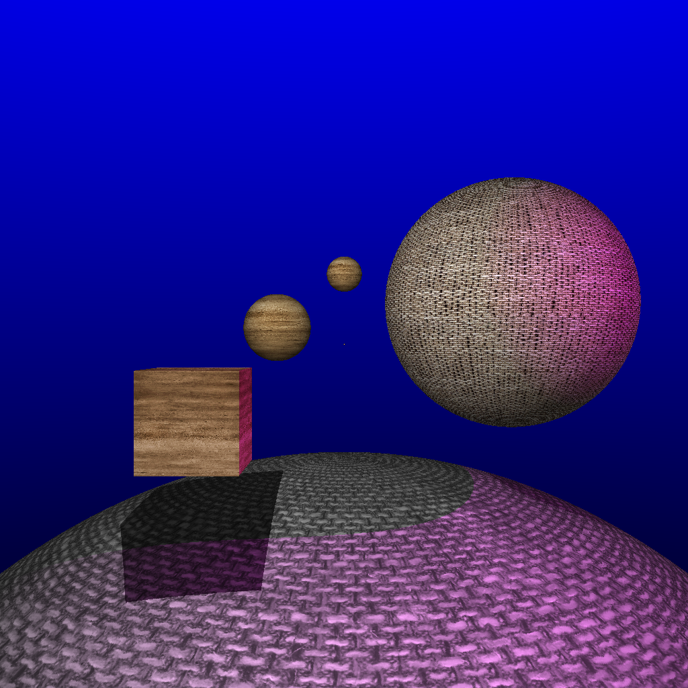
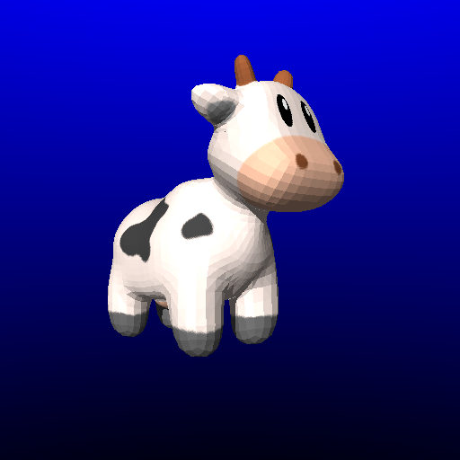
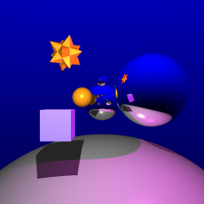
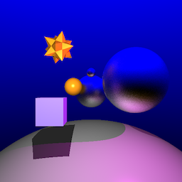
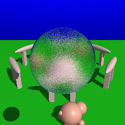

## Ray Tracer

### Adaptive Anti-Aliasing
Adaptive anti-aliasing is used to remove jaggies only at pixels whose intensity differs from its neighbors by some threshold.

### Soft Shadows 
Shadow rays are distributed across the light source to create the appearance of soft shadows.

### Bump Mapping
Bump mapping is implemented by using a height displacement to calculate perturbed normals, creating a bumpy or wrinkled appearance.

### Texture Mapping
Texture mapping is implemented for spheres, cubes, and meshes.

### Depth of Field
A focal length and aperture can be specified to produce a depth of field effect.

### Reflection
Reflection is implemented for reflective objects, recursively casting a secondary ray in the direction of reflection.

### Refraction
Refraction is implemented for translucent objects, recursively casting a secondary ray in the direction of transmission given by Snell's law.

### Glossy Reflection
Multiple reflection rays are pertubed from the angle of reflection to create glossy reflection.

 

### Glossy Refraction
Multiple refraction rays are perturbed from the angle of refraction to create glossy refraction. Fresnel's law is used to ...

### Extra Objective: Phong Shading
Barycentric coordinates are used to interpolate normal vectors.

 

### Final Scene
A unique final scene is created which demonstrates the graphical objectives of the ray tracer.