## Ray Tracer

### Adaptive Anti-Aliasing
Adaptive anti-aliasing is used to remove jaggies only at pixels whose intensity differs from its neighbors by some threshold. The center image below shows the pixels which have been chosen for supersampling. Note how these pixels typically correspond to edges of objects. 

|   |   |    |
| Image without antialiasing  | Resampled pixels  | Antialiased image |

### Soft Shadows 
Shadow rays are distributed across the light source to create the appearance of soft shadows. Multiple shadows rays are cast from each point of intersection to a random point on each area (spherical) light source, and the light intensities of each ray are averaged. 

|   |   |
| Hard shadows  | Soft shadows |

### Bump Mapping
Bump mapping is implemented by using a height displacement to calculate perturbed normals, creating a bumpy or wrinkled appearance. For the two images below, note how the shadows are cast differently depending on the location of the light source.

| 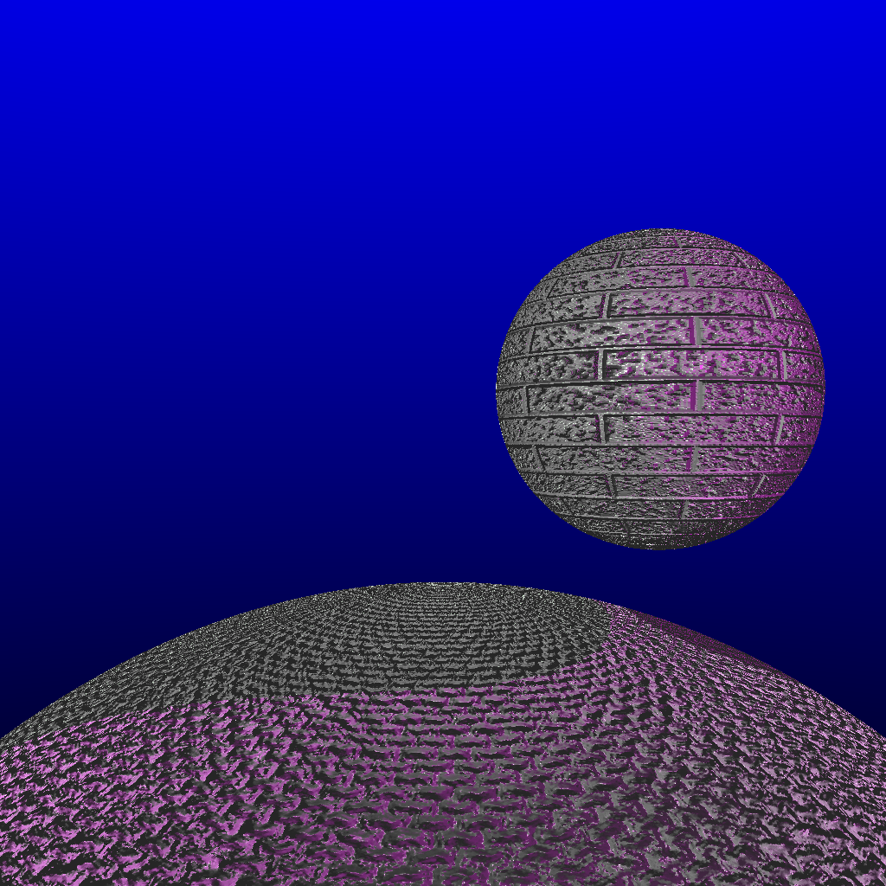  |  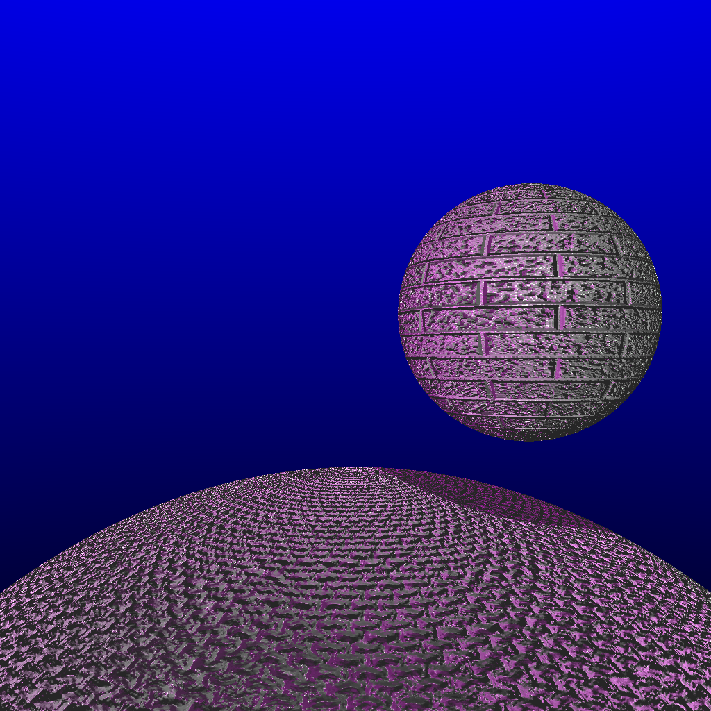 |
| Light from the right side  | Light from the left side |

### Texture Mapping
Texture mapping is implemented for spheres, cubes, and meshes. Each point of intersection is mapped to a UV coordinate, which is then mapped onto a texture map to determine the color for each pixel. Spheres are UV mapped by converting the Euclidean coordinates to spherical coordinates. Triangular meshes are UV mapped by interpolation using barycentric coordinates, given the UV coordinates of the 3 vertices of the face. 

| 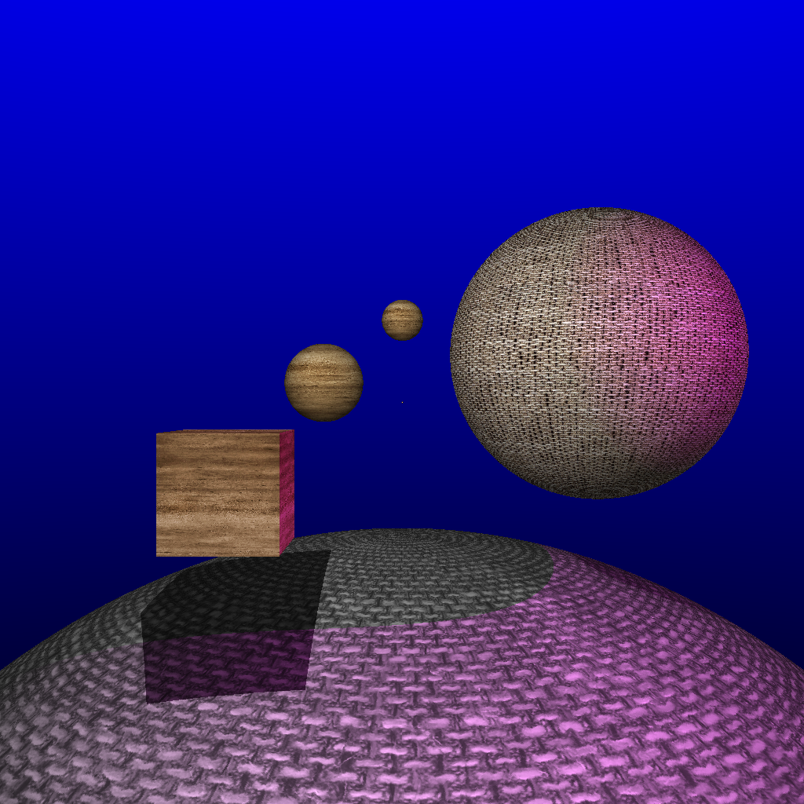  |  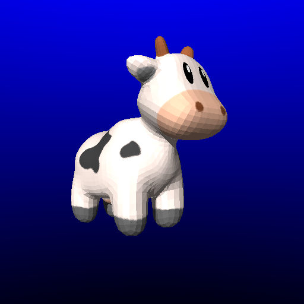 |
| Textured primitives  | Textured triangular mesh |

### Depth of Field
A focal length and aperture can be specified to produce a depth of field effect. The intersection of the focal plane Q and the eye-to-pixel direction ray are determined, and then multiple rays are traced from random points on the lens to Q.

| 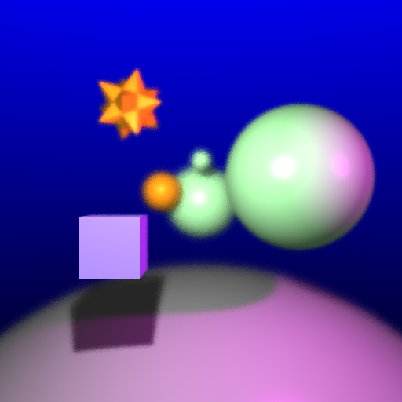  |   |    |
| Focal length of 700 | Focal length of 900 | Focal length of 1100 |

### Reflection
Reflection is implemented for reflective objects, recursively casting a secondary ray in the direction of reflection.

| 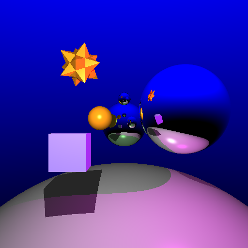  |  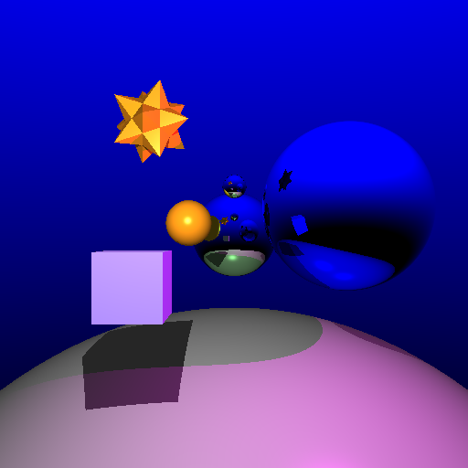 |
| Mirror reflection | Colored reflection |

### Refraction
Refraction is implemented for translucent objects, recursively casting a secondary ray in the direction of transmission given by Snell's law. Schlick's approximation of Fresnel's law is used to determine the ratio between reflected and refracted light for each ray. Note the reflection of the sky at the edges of the sphere in both images.

| 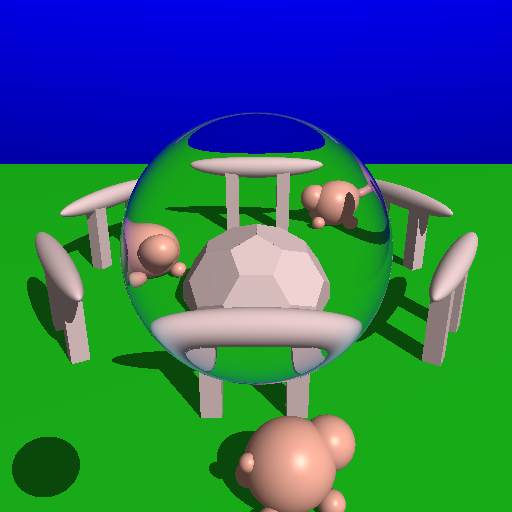  |  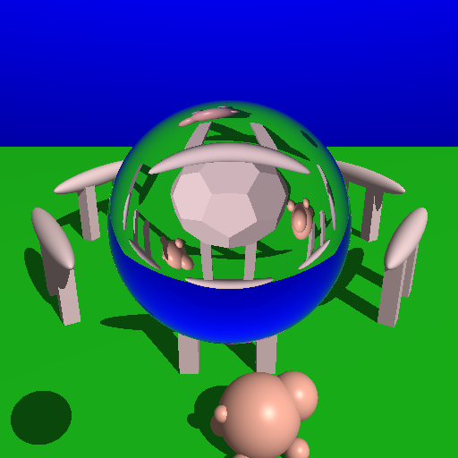 |
| Refraction index of 1.01 | Refraction index of 1.33 |

### Glossy Reflection
Multiple reflection rays are pertubed from the angle of reflection to create glossy reflection. 

|   |  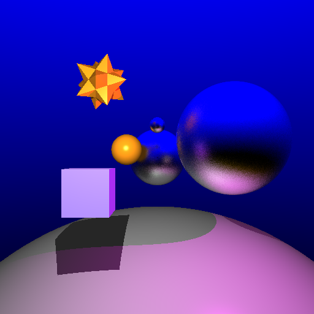 |
| Mirror reflection | Glossy reflection |

### Glossy Refraction
Multiple refraction rays are perturbed from the angle of refraction to create glossy refraction.

|   |  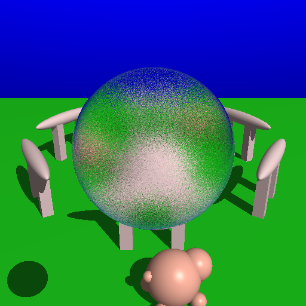 |    |
| Normal refraction | Glossy refraction using 4 rays | Glossy refraction using 64 rays |

### Extra Objective: Phong Shading
Phong shading is implemented, giving triangular meshes a smoother appearance. Barycentric coordinates are used to interpolate normal vectors, given the vertex normals of the 3 vertices of each face. 

|   |  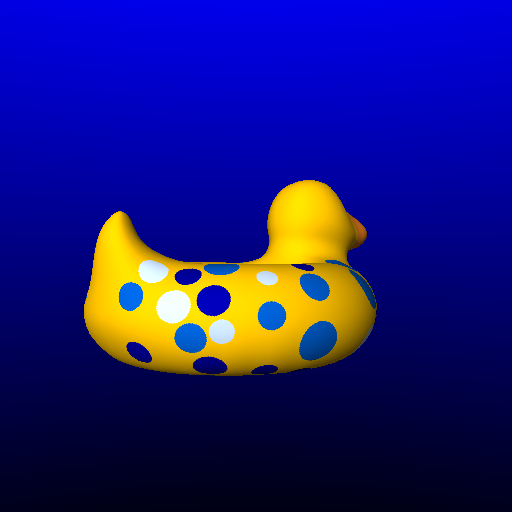 |
| No phong shading | Phong shading | 

### Final Scene
A unique final scene is created which demonstrates the graphical objectives of the ray tracer. Note the use of texture mapping, Phong shading, bump mapping (for the wall), adaptive antialiasing, soft shadows, and glossy reflection (for the crystal ball). The models and textures were all found online (and triangulated and decimated using Blender).

| 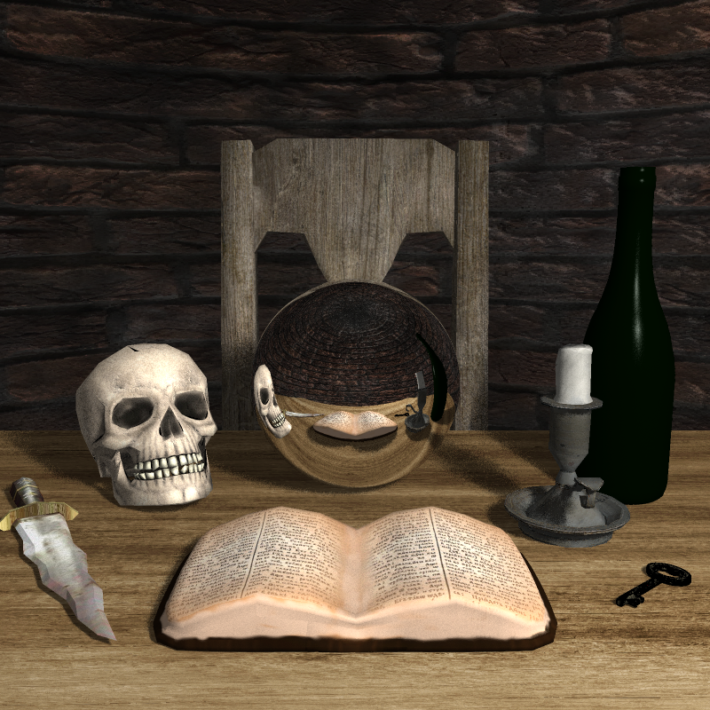  |  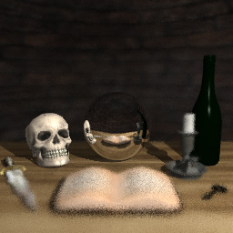 |
| Mirror reflection | Depth of field | 
