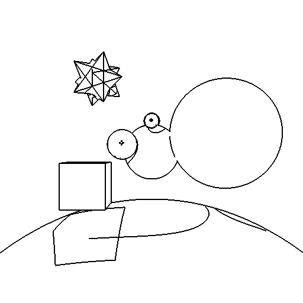

## Ray Tracer

### Adaptive Anti-Aliasing
Adaptive anti-aliasing is used to remove jaggies only at pixels whose intensity differs from its neighbors by some threshold.

|   |   |    |
| Image without antialiasing  | Resampled pixels  | Antialiased image |

### Soft Shadows 
Shadow rays are distributed across the light source to create the appearance of soft shadows.

|   |   |
| Hard shadows  | Soft shadows |

### Bump Mapping
Bump mapping is implemented by using a height displacement to calculate perturbed normals, creating a bumpy or wrinkled appearance.

|   |   |
| Light from the right side  | Light from the left side |

### Texture Mapping
Texture mapping is implemented for spheres, cubes, and meshes.

|   |   |
| Textured primitives  | Textured triangular mesh |

### Depth of Field
A focal length and aperture can be specified to produce a depth of field effect.

|   |   |    |
| Focal length of 700 | Focal length of 900 | Focal length of 1100 |

### Reflection
Reflection is implemented for reflective objects, recursively casting a secondary ray in the direction of reflection.

|   |   |
| Mirror reflection | Colored reflection |

### Refraction
Refraction is implemented for translucent objects, recursively casting a secondary ray in the direction of transmission given by Snell's law.

|   |   |
| Refraction index of 1.01 | Refraction index of 1.33 |

### Glossy Reflection
Multiple reflection rays are pertubed from the angle of reflection to create glossy reflection.

|   |   |
| Mirror reflection | Glossy reflection |

### Glossy Refraction
Multiple refraction rays are perturbed from the angle of refraction to create glossy refraction. Fresnel's law is used to ...

|   |   |    |
| ------ | ------ | ------ |
| Normal refraction | Glossy refraction using 4 rays | Glossy refraction using 64 rays |

### Extra Objective: Phong Shading
Barycentric coordinates are used to interpolate normal vectors.

|   |   |
| No phong shading | Phong shading | 

### Final Scene
A unique final scene is created which demonstrates the graphical objectives of the ray tracer.

